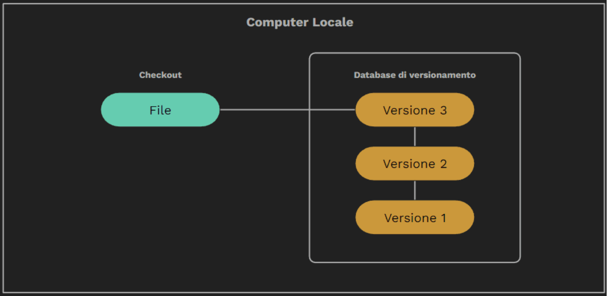
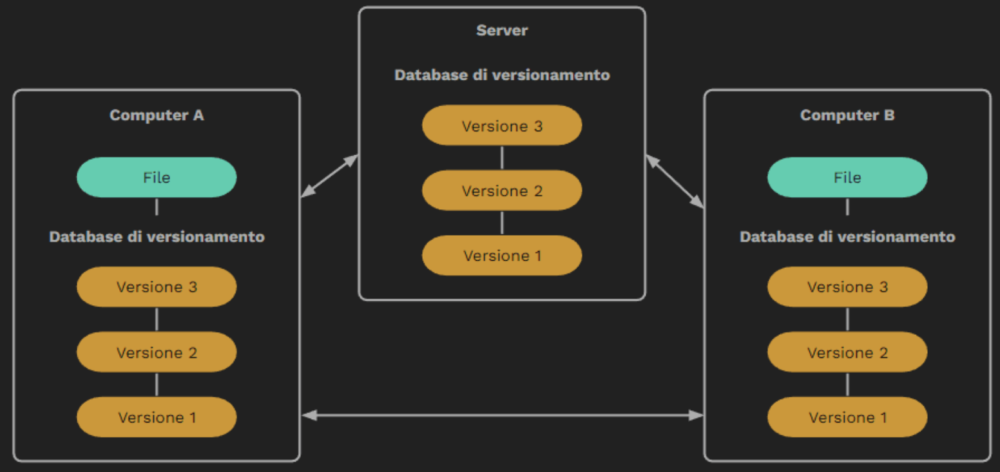
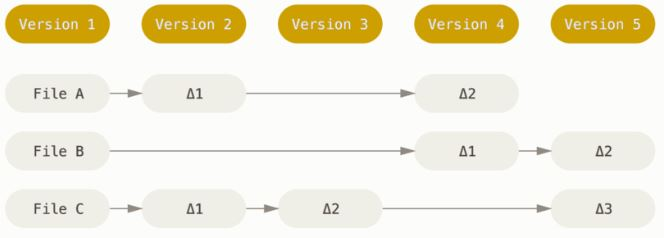
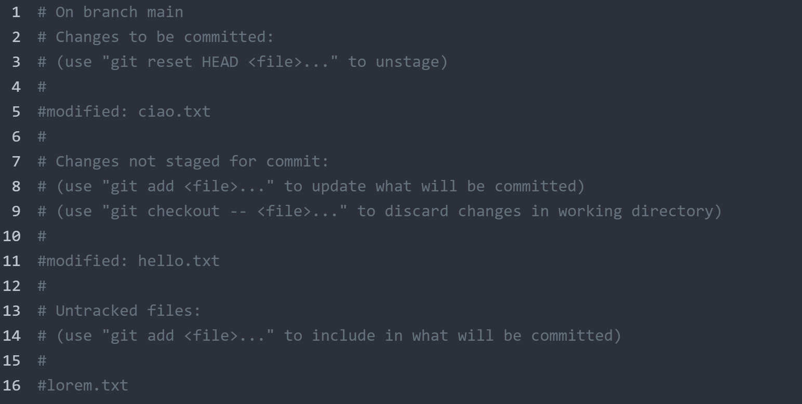

## Git
Git è un version control system, uno strumento che aiuta a gestire i cambiamenti nel codice sorgente nel tempo
### Le funzionalità principali di un VCS

* Cronologia completa delle modifiche di un file (creazione, cancellazione, modifica, spostamento e cancellazione). Ognuna di queste è accompagnata da ulteriori informazioni come autore, data e note sulla modifica.
* Possibilità di divergere e lavorare in flussi di modifiche isolati, chiamati rami.  Questa funzionalità è nota come branching o ramificazione.
* I flussi isolati possono essere riunificati in qualsiasi momento al flusso principale. Questo si chiama merging o unificazione.
* Verifica e segnalazione preventiva dei conflitti così da evitare di portare dei malfunzionamenti inattesi nel flusso principale.
* Nel caso di errore si può “tornare indietro” ad una versione precedente, correggendo l’errore ed evitando malfunzionamenti prolungati.

### I VCS
Esistono tre tipologie di VCS: 
* locali

* centralizzati

* distribuiti

## Come funziona un VCS

I vecchi VCS salvano l’informazione come una lista di modifiche ai file.

I DVCS come Git considerano i propri dati più come una sequenza di istantanee (snapshot).

Con Git, ogni volta che registri, fai un commit, crei un’immagine di tutti i file tracciati presenti nella repo in quel momento, salvando un riferimento allo snapshot con hash SHA1 + checksum di controllo integrità dei file.

## SHA 1 e checksum dei commit 

Qualsiasi cosa in Git è controllata.  Il meccanismo che Git usa per fare il commit è una hash SHA-1. Si tratta di una stringa di 40-caratteri, composta da caratteri esadecimali (0–9 ed a–f) e calcolata in base al contenuto dei file o della struttura della directory in Git.  Un hash SHA-1 assomiglia a qualcosa come: 
***24b9da6552252987aa493b52f8696cd6d3b00373*** 

L'hash contiene un checksum. Questo significa che è impossibile cambiare il contenuto di qualsiasi file o directory senza che Git lo sappia.

### Le aree di lavoro di Git

Le aree di Git sono tre e sono:

1. La Working Directory dove risiede il codice sorgente nella sua versione più recente. Corrisponde alla cartella nel nostro computer, quella che apriamo nel nostro editor per lavorare.

2. La Staging Area, area fittizia, non esiste veramente, qui è dove i file vengono contrassegnati per essere inclusi nella commit successiva.

3. La Git Directory, lo spazio, nel database dove i file vengono salvati e custoditi.

### Gli stati dei file

I file del nostro progetto possono cambiare di stato.  Git infatti ce li contrassegnerà in modo differente in base a delle specifiche situazioni, come:

* Senza traccia (Untracked): il file è presente nella directory di lavoro, ma non è stato mai oggetti di commit o inserito in staging area.
* Senza storia (Staged): il file è stato aggiunto per la prima volta alla staging area, questo fa sì che Git gli assegni un indice.
* Modificato (Modified): Il file è stato precedentemente salvato nella git directory e ciò che è presente nella working directory non corrisponde.
* Committed: Il file è stato salvato nella git directory e quello presente in working directory è identico.

### Il workflow di base in Git

1. Modifica dei file nella Working Directory
2. Contrassegna dei file da includere nella successiva commit, inserendoli nella Staging Area
3. Commit dei file presenti  nell’area di stage.

[Git Basics Getting a Repository](https://git-scm.com/book/en/v2/Git-Basics-Getting-a-Git-Repository#ch02-git-basics-chapter)

## Prima configurazione di Git

Ci sono molti modi diversi di usare Git.
***La riga di comando è l’unico posto dove puoi eseguire tutti i comandi di Git.*** 

Git viene fornito con uno strumento chiamato ***git config*** che ti consente di ottenere e impostare variabili di configurazione che controllano tutti gli aspetti e il funzionamento di Git

Puoi visualizzare tutte le tue impostazioni e la loro provenienza utilizzando:

*$ git config --list --show-origin*

La prima cosa che dovresti fare quando installi Git è impostare il tuo nome utente e indirizzo email. Questo è importante perché ogni commit Git utilizza queste informazioni e sono immutabili nei commit che inizi a creare:

*$ git config --global user.name "John Doe"*

*$ git config --global user.email johndoe@example.com*

Se vuoi controllare le tue impostazioni di configurazione, puoi usare

*$ git config --list*

## Getting a Git Repository from comand line

 * Creare e inizializzare una working directory

   

(main) mi dice che la directory Repo è stata inizializzata e siamo sul ramo main

* creare file nella directory Repo

* Comando echo alternativo
 
* Altro comando interessante alias:  registro un comando con un unica parola graph

 
 * controllo lo stato della Repo 

  

* aggiungo i file alla staging area

* eseguo la prima commit /snapshot della mia Repo

____ 

## Git reset 

 ### Da staging area a working directory

   
### da repository a staging area: il comando log e il comando reset

Git salva ogni Commit in un formato chiave/valore, dove la chiave è una stringa SHA1 con Checksum per il controllo dell'integrità del Commit

HEAD è il puntatore, indica su quale commit stiamo lavorando 

Il comando git --oneline è molto comodo quando abbiamo molte commit.

* da repository a staging area: il comando amend

apre un editor della commit per modificarla

* da repository a staging area: il comando reset

la versione soft riporta lo stato dei file alla prima commit modificata preonta per essere committata. (HEAD ora punta sulla first commit), i file non sono stati modificati

la versione mixed riporta lo stato ei file alla first commit. I file sono stati modificati.

la versione hard cancella le modifiche della second commit

## Gitignore

apri il file gitignore con un editor di testo e scrivi al suo interno le cartelle o i file che voglio nascondere.

## Carichiamo la Repo su Github 
Dal mio account Githu.com creo una nuova Repo. Arriveremo alla schermata successiva

Abbiamo già creato una Repo in locale, quindi facciamo il push-download della Repo creata su github

git remote add indica il percorso in remoto (github, disco in locale, altro pc) dove posizionare i file che creiamo e modifichiamo in locale.  origin è il nome che diamo all'url

git push fa l'upload dei file sul server remoto 
-u specifica il server remoto di default cosi da digitare successivamente il semplice comando git push 
main indica il branch che verrà uploaddato 

git branch -M main mi posiziona nel branch main

refresh pagina; alla mia Repo sono stati aggiunti i file che avevo creato in locale

## Git remote, gestire i servere remoti

[Github managing remote Repo](https://docs.github.com/en/get-started/getting-started-with-git/managing-remote-repositories)

## Git branch

Versioni parallele dei nostri file utilizzate per sviluppare differenti versioni di sviluppo della nostra Repo.  Queste versioni parallele con il tempo possono essere unite alla principale o rimanere separate

* creare branch

L'asterisco mi indica dove sta puntando HEAD

Spostarsi di branch da main a fix

git merge

git branch --merged

git branch -d fix   -cancella branch unito a main

git branch -D fix   -cancella branch che non è stato ancora unito alla main

[Git branch OODeveloper](https://www.youtube.com/watch?v=IXSNTvJmyp8&t=911s) a 20 min come risolvere i conflitti

## Git pull e fetch da remoto a locale

Creo un file da remoto

Git fetch sincronizza le commit da remoto a locale, poi noi facciamo il merge per unirle. 

Git pull unisce i due comandi in uno è il più utilizzato.

[OODeveloper](https://www.youtube.com/watch?v=qqLWkaqC2EI&list=PL9MslR9MhrJbO7u34sgR3J6iMqkFmVenG&index=7)

## Git clone

Crea una copia in locale della repository su Github
* creo directory in locale
* mi posiziono sulla directory e apro con tasto destro la riga di comando bash
* git clone + https della Repo copiato da Github

[OODeveloper](https://www.youtube.com/watch?v=tHzHXtSOxqo&list=PL9MslR9MhrJbO7u34sgR3J6iMqkFmVenG&index=8)

La Repo può essere pushata e pullata come nel caso di Repo sincronizzata da remoto.

aggiunge
These are common Git commands used in various situations:

start a working area (see also: git help tutorial)
   clone     Clone a repository into a new directory
   init      Create an empty Git repository or reinitialize an existing one

work on the current change (see also: git help everyday)
   add       Add file contents to the index
   mv        Move or rename a file, a directory, or a symlink
   restore   Restore working tree files
   rm        Remove files from the working tree and from the index

examine the history and state (see also: git help revisions)
   bisect    Use binary search to find the commit that introduced a bug
   diff      Show changes between commits, commit and working tree, etc
   grep      Print lines matching a pattern
   log       Show commit logs
   show      Show various types of objects
   status    Show the working tree status

grow, mark and tweak your common history
   branch    List, create, or delete branches
   commit    Record changes to the repository
   merge     Join two or more development histories together
   rebase    Reapply commits on top of another base tip
   reset     Reset current HEAD to the specified state
   switch    Switch branches
   tag       Create, list, delete or verify a tag object signed with GPG

collaborate (see also: git help workflows)
   fetch     Download objects and refs from another repository
   pull      Fetch from and integrate with another repository or a local branch
   push      Update remote refs along with associated objects
