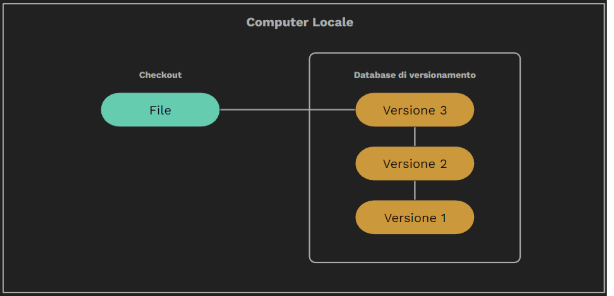
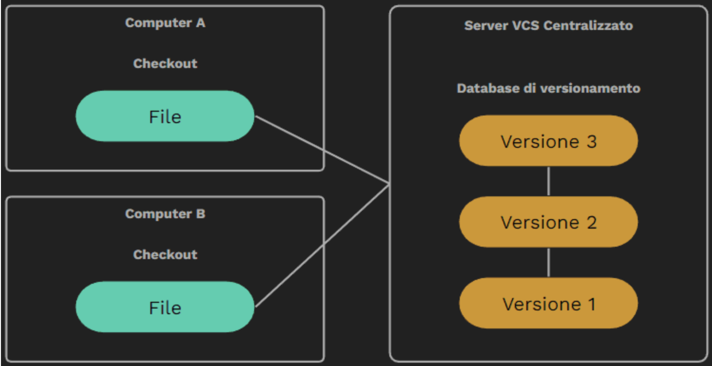
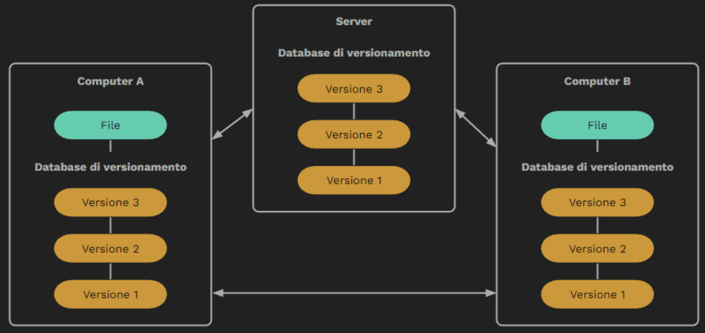
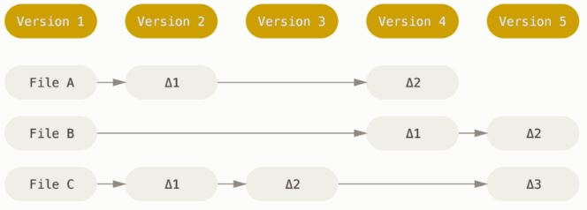
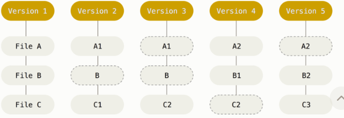
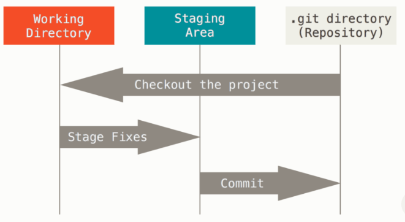

## Git

### Abstract
GitHub è un Social Network con una sua caratteristica che lo distingue dagli altri: il controllo di versione.
Permette agli utenti di condividere file tenendo traccia delle versioni  e relative modifiche pubblicate.
Diventa quindi un ottimo strumento per chi sviluppa software ma anche per chi vuole condividere un documento di testo.

### Le funzionalità principali di un VCS

* Cronologia completa delle modifiche di un file (creazione, cancellazione, modifica, spostamento e cancellazione). Ognuna di queste è accompagnata da ulteriori informazioni come autore, data e note sulla modifica.
* Possibilità di divergere e lavorare in flussi di modifiche isolati, chiamati rami.  Questa funzionalità è nota come branching o ramificazione.
* I flussi isolati possono essere riunificati in qualsiasi momento al flusso principale. Questo si chiama merging o unificazione.
* Verifica e segnalazione preventiva dei conflitti così da evitare di portare dei malfunzionamenti inattesi nel flusso principale.
* Nel caso di errore si può “tornare indietro” ad una versione precedente, correggendo l’errore ed evitando malfunzionamenti prolungati.

### I VCS
Esistono tre tipologie di VCS: 
* locali

* Centralizzati

* distribuiti

## Come funziona un VCS

I vecchi VCS salvano l’informazione come una lista di modifiche ai file.

I DVCS come Git considerano i propri dati più come una sequenza di istantanee (snapshot).

Con Git, ogni volta che registri, fai un commit, crei un’immagine di tutti i file tracciati presenti nella repo in quel momento, salvando un riferimento allo snapshot con hash SHA1 + checksum di controllo integrità dei file.

## SHA 1 e checksum dei commit 

Qualsiasi cosa in Git è controllata.  Il meccanismo che Git usa per fare il commit è una hash SHA-1. Si tratta di una stringa di 40-caratteri, composta da caratteri esadecimali (0–9 ed a–f) e calcolata in base al contenuto dei file o della struttura della directory in Git.  Un hash SHA-1 assomiglia a qualcosa come: 
***24b9da6552252987aa493b52f8696cd6d3b00373*** 

L'hash contiene un checksum. Questo significa che è impossibile cambiare il contenuto di qualsiasi file o directory senza che Git lo sappia.

### Le aree di lavoro di Git

Le aree di Git sono tre e sono:

1. La Working Directory dove risiede il codice sorgente nella sua versione più recente. Corrisponde alla cartella nel nostro computer, quella che apriamo nel nostro editor per lavorare.

2. La Staging Area, area fittizia, non esiste veramente, qui è dove i file vengono contrassegnati per essere inclusi nella commit successiva.

3. La Git Directory, lo spazio, nel database dove i file vengono salvati e custoditi.

### Gli stati dei file

I file del nostro progetto possono cambiare di stato.  Git infatti ce li contrassegnerà in modo differente in base a delle specifiche situazioni, come:

* Senza traccia (Untracked): il file è presente nella directory di lavoro, ma non è stato mai oggetti di commit o inserito in staging area.
* Senza storia (Staged): il file è stato aggiunto per la prima volta alla staging area, questo fa sì che Git gli assegni un indice.
* Modificato (Modified): Il file è stato precedentemente salvato nella git directory e ciò che è presente nella working directory non corrisponde.
* Committed: Il file è stato salvato nella git directory e quello presente in working directory è identico.

### Il workflow di base in Git

1. Modifica dei file nella Working Directory
2. Contrassegna dei file da includere nella successiva commit, inserendoli nella Staging Area
3. Commit dei file presenti  nell’area di stage.

